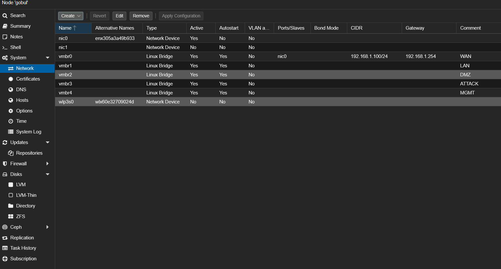

# 01 — Configuration réseau Proxmox

## Objectif

Créer les bridges virtuels qui serviront de switches internes au lab. Proxmox n'aura d'IP que sur `vmbr0` — tous les autres bridges sont isolés, sans IP, gérés exclusivement par pfSense.

## Résultat attendu

| Bridge | Rôle | IP Proxmox |
|--------|------|------------|
| `vmbr0` | WAN — connecté au réseau physique (box FAI) | `192.168.1.100/24` |
| `vmbr1` | LAN — réseau interne du lab | aucune |
| `vmbr2` | DMZ — zone serveurs exposés | aucune |
| `vmbr3` | ATTACK — réseau isolé Kali | aucune |
| `vmbr4` | MGMT — supervision et monitoring | aucune |

---

## Procédure

### Création des bridges

Pour chaque bridge (`vmbr1`, `vmbr2`, `vmbr3`, `vmbr4`) via **Système > Réseau > Créer > Linux Bridge** :

- IPv4/CIDR : vide
- Gateway : vide
- Bridge ports : vide
- VLAN aware : non coché

| Bridge | Commentaire |
|--------|-------------|
| `vmbr1` | LAN |
| `vmbr2` | DMZ |
| `vmbr3` | ATTACK |
| `vmbr4` | MGMT |

Cliquer sur **Appliquer la configuration** et confirmer.

---

## Validation

La page réseau affiche les 5 bridges actifs :

---

➡️ Étape suivante : [02 — VM pfSense](02-pfsense-vm.md)
