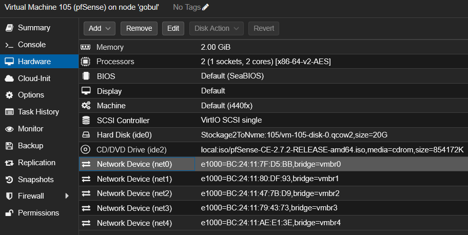
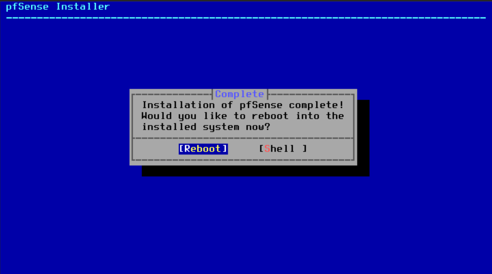
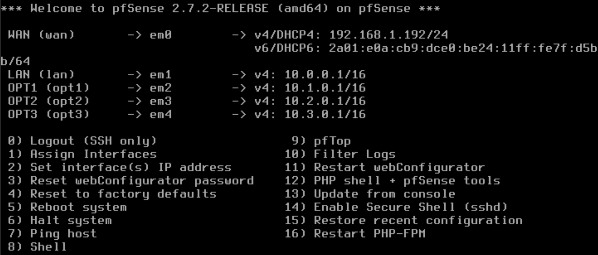

# 02 — Déploiement de la VM pfSense

## Objectif

Déployer pfSense comme firewall central du lab. Il sera le seul point d'entrée/sortie entre le réseau domestique (WAN) et les réseaux virtuels internes (LAN, DMZ, ATTACK, MGMT).

## Résultat attendu

- VM pfSense opérationnelle avec 5 interfaces réseau
- pfSense accessible depuis le LAN sur `https://10.0.0.1`
- Routage inter-réseaux fonctionnel

---

## Procédure

### Création de la VM

**Datacenter > Créer VM** avec les paramètres suivants :

| Paramètre | Valeur |
|-----------|--------|
| VM ID | `105` |
| Nom | `pfSense` |
| ISO | `pfSense-CE-2.7.2-RELEASE-amd64.iso` |
| Type OS | Other |
| BIOS | Default (SeaBIOS) |
| Machine | Default (i440fx) |
| SCSI Controller | VirtIO SCSI single |
| Disque | `20 GB` |
| CPU | 2 cores |
| RAM | `2048 MB` |

Après création, ajout des 4 interfaces restantes via **Hardware > Add > Network Device** :

| Interface | Bridge | Rôle |
|-----------|--------|------|
| `net0` | `vmbr0` | WAN |
| `net1` | `vmbr1` | LAN |
| `net2` | `vmbr2` | DMZ |
| `net3` | `vmbr3` | ATTACK |
| `net4` | `vmbr4` | MGMT |



---

### Installation de pfSense

Démarrage de la VM, installation via la console :

1. Accept → Install pfSense
2. Keymap → default
3. Partitioning → Auto (ZFS) → Stripe → sélection du disque → OK
4. Retrait de l'ISO avant le reboot : **Hardware > CD/DVD Drive > Do not use any media**



---

### Configuration des interfaces

Assignation des interfaces via le menu console (option `1`) :

```
Should VLANs be set up now? → n
WAN  → em0
LAN  → em1
OPT1 → em2
OPT2 → em3
OPT3 → em4
Proceed? → y
```

Configuration des IPs via l'option `2` :

| Interface | IP | Masque | DHCP |
|-----------|-----|--------|------|
| LAN (em1) | `10.0.0.1` | `/16` | `10.0.1.0` → `10.0.254.254` |
| OPT1 (em2) | `10.1.0.1` | `/16` | `10.1.1.0` → `10.1.254.254` |
| OPT2 (em3) | `10.2.0.1` | `/16` | `10.2.1.0` → `10.2.254.254` |
| OPT3 (em4) | `10.3.0.1` | `/16` | `10.3.1.0` → `10.3.254.254` |

---

## Validation

Le menu principal pfSense affiche les 5 interfaces actives :



L'interface web est accessible sur le LAN : `https://10.0.0.1`

---

⬅️ Étape précédente : [01 — Réseau Proxmox](01-proxmox-network.md)
