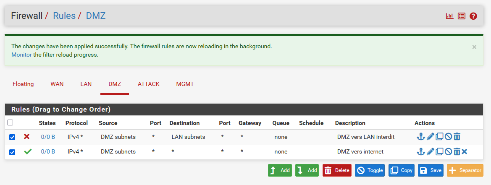
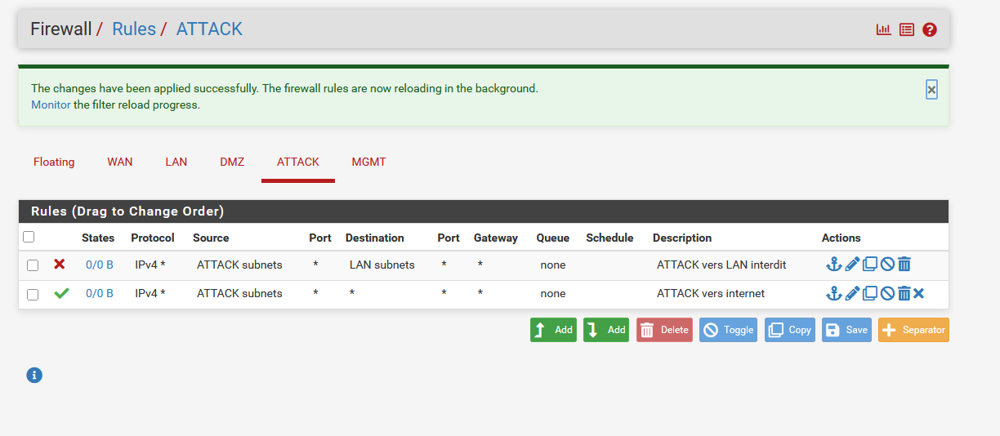
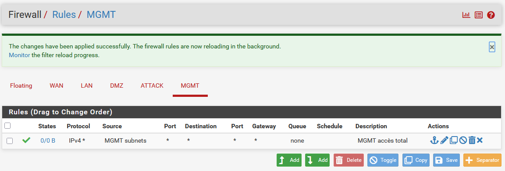

# 03 — Configuration initiale pfSense

## Objectif

Configurer pfSense via l'interface web : paramètres système, nommage des interfaces, règles firewall et DHCP.

## Résultat attendu

- Interface web accessible depuis le LAN sur `https://10.0.0.1`
- Interfaces nommées : WAN / LAN / DMZ / ATTACK / MGMT
- Règles firewall inter-réseaux appliquées
- DHCP actif sur toutes les interfaces internes

---

## Procédure

### Accès à l'interface web

Par défaut pfSense bloque l'accès depuis le WAN. Activation temporaire depuis la console :

```bash
pfSsh.php playback enableallowallwan
```


---

### Paramètres généraux

**System > General Setup**

| Paramètre | Valeur |
|-----------|--------|
| Hostname | `pfSense` |
| Domain | `lab.local` |
| Primary DNS | `8.8.8.8` |
| Secondary DNS | `8.8.4.4` |
| Timezone | `Europe/Paris` |

Mot de passe admin par défaut `pfsense` remplacé via **System > User Manager**.

---

### Nommage des interfaces

**Interfaces > OPT1 / OPT2 / OPT3**

| Interface | Nom | IP |
|-----------|-----|----|
| OPT1 | `DMZ` | `10.1.0.1/16` |
| OPT2 | `ATTACK` | `10.2.0.1/16` |
| OPT3 | `MGMT` | `10.3.0.1/16` |


---

### Règles Firewall

Politique appliquée :

| Source | Destination | Action |
|--------|-------------|--------|
| LAN | Any | ✅ Pass |
| DMZ | LAN | ❌ Block |
| DMZ | Any | ✅ Pass |
| ATTACK | LAN | ❌ Block |
| ATTACK | Any | ✅ Pass |
| MGMT | Any | ✅ Pass |

> ⚠️ L'ordre des règles est important — pfSense applique la première règle qui correspond. Les règles Block doivent toujours être placées **au-dessus** des règles Pass.

**DMZ :**



**ATTACK :**



**MGMT :**



---

### NAT

**Firewall > NAT > Outbound** — mode **Automatic**. pfSense génère automatiquement les règles NAT pour tous les réseaux internes vers le WAN.

---

### DHCP

**Services > DHCP Server** — actif sur toutes les interfaces internes :

| Interface | Plage DHCP |
|-----------|------------|
| LAN | `10.0.1.0` → `10.0.254.254` |
| DMZ | `10.1.1.0` → `10.1.254.254` |
| ATTACK | `10.2.1.0` → `10.2.254.254` |
| MGMT | `10.3.1.0` → `10.3.254.254` |

---

### Désactivation de l'accès WAN

Une fois la configuration terminée :

```bash
pfSsh.php playback disableallowallwan
```

---

## Validation

- ✅ Interface web accessible sur `https://10.0.0.1` depuis le LAN
- ✅ 5 interfaces nommées et actives
- ✅ Règles firewall inter-réseaux appliquées
- ✅ DHCP actif sur toutes les interfaces
- ✅ NAT automatique configuré
- ✅ Accès WAN désactivé

---

⬅️ Étape précédente : [02 — VM pfSense](02-pfsense-vm.md)
