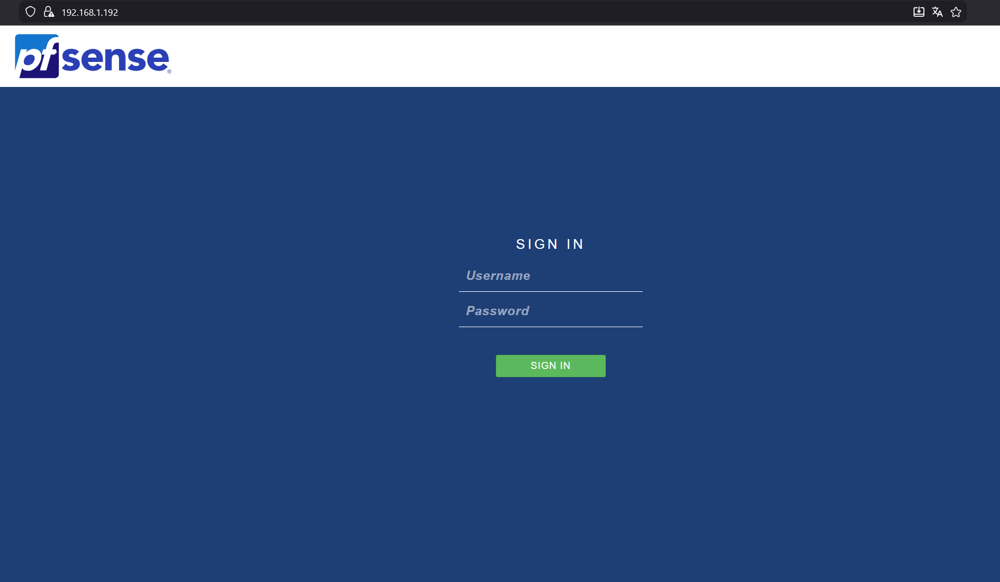
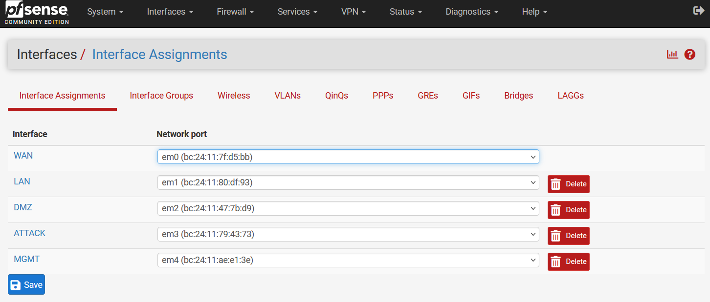
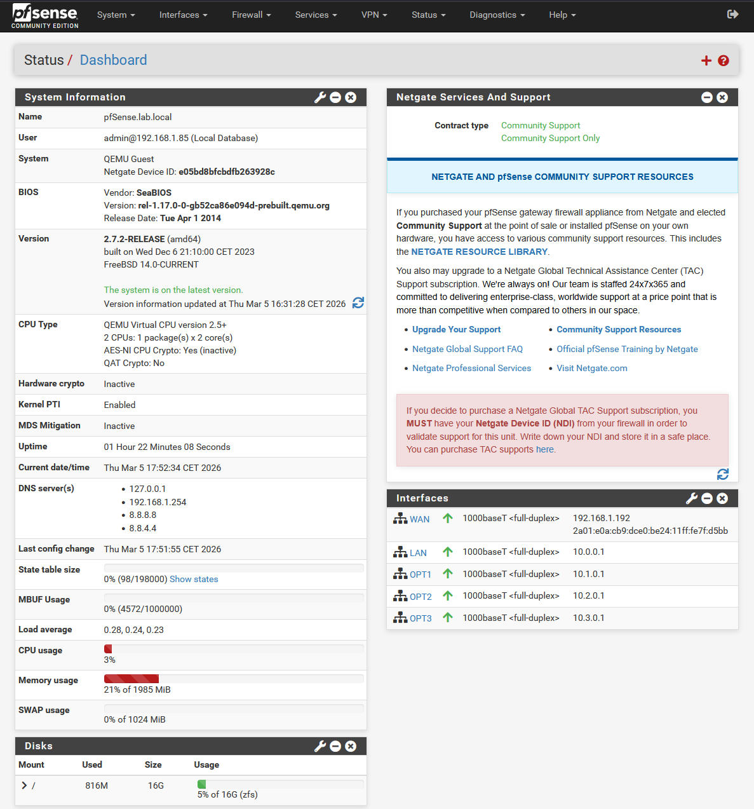

# 03 — Configuration initiale pfSense

## Objectif

Configurer pfSense via l'interface web : paramètres système, nommage des interfaces, règles firewall de base et sécurisation de l'accès à l'administration.

## Résultat attendu

- Interface web accessible depuis le LAN sur `https://10.0.0.1`
- Interfaces nommées : WAN / LAN / DMZ / ATTACK / MGMT
- Mot de passe admin changé
- Accès WAN à l'interface web désactivé

---

## Procédure

### Accès temporaire depuis le WAN

Par défaut pfSense bloque l'accès à son interface web depuis le WAN. Pour la configuration initiale, l'accès est temporairement activé depuis la console :

```bash
pfSsh.php playback enableallowallwan
```

> ⚠️ Cette règle est désactivée immédiatement après la configuration initiale.



---

### Paramètres généraux

**System > General Setup**

| Paramètre | Valeur |
|-----------|--------|
| Hostname | `pfSense` |
| Domain | `lab.local` |
| Primary DNS | `8.8.8.8` |
| Secondary DNS | `8.8.4.4` |
| Timezone | `Europe/Paris` |

---

### Changement du mot de passe admin

**System > User Manager > admin > Edit**

Mot de passe par défaut `pfsense` remplacé par un mot de passe fort.

---

### Nommage des interfaces

**Interfaces > OPT1 / OPT2 / OPT3** — renommage des interfaces optionnelles :

| Interface | Nouveau nom | IP |
|-----------|-------------|-----|
| OPT1 | `DMZ` | `10.1.0.1/16` |
| OPT2 | `ATTACK` | `10.2.0.1/16` |
| OPT3 | `MGMT` | `10.3.0.1/16` |



---

### Dashboard



---

### Désactivation de l'accès WAN

Une fois la configuration terminée, l'accès WAN est désactivé depuis la console :

```bash
pfSsh.php playback disableallowallwan
```

---

## Validation

- ✅ Interface web accessible sur `https://10.0.0.1` depuis le LAN
- ✅ 5 interfaces nommées et actives
- ✅ Accès WAN à l'interface web désactivé
- ✅ Règles LAN par défaut actives (allow all)

---

⬅️ Étape précédente : [02 — VM pfSense](02-pfsense-vm.md)
