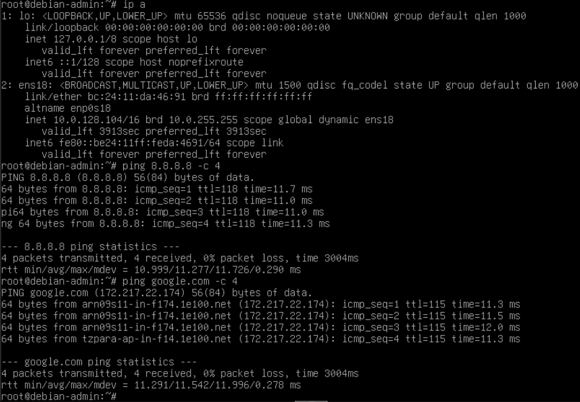

# 04 — VM Debian Admin

## Objectif

Déployer une VM Debian légère sur le réseau LAN pour administrer le lab et valider la connectivité internet via pfSense.

## Résultat attendu

- VM Debian opérationnelle sur le LAN (`vmbr1`)
- IP DHCP attribuée par pfSense dans la plage `10.0.0.0/16`
- Accès internet fonctionnel via pfSense

---

## Procédure

### Création de la VM

| Paramètre | Valeur |
|-----------|--------|
| VM ID | `101` |
| Nom | `debian-admin` |
| ISO | `debian-12.x-amd64-netinst.iso` |
| Disque | `20 GB` |
| CPU | 2 cores |
| RAM | `2048 MB` |
| Réseau | `vmbr1` — LAN |

### Installation

Installation minimale sans interface graphique :
- Paquets installés : **SSH server** + **utilitaires usuels du système**

### Configuration réseau

IP attribuée automatiquement par le DHCP de pfSense :

```
ens18: 10.0.x.x/16
Gateway: 10.0.0.1
```

### Outils installés

```bash
apt install -y curl wget net-tools nmap tcpdump
```

---

## Validation

Connectivité internet via pfSense confirmée :



---

⬅️ Étape précédente : [03 — Configuration pfSense](03-pfsense-config.md)
➡️ Étape suivante : [05 — OpenVPN](05-openvpn.md)
