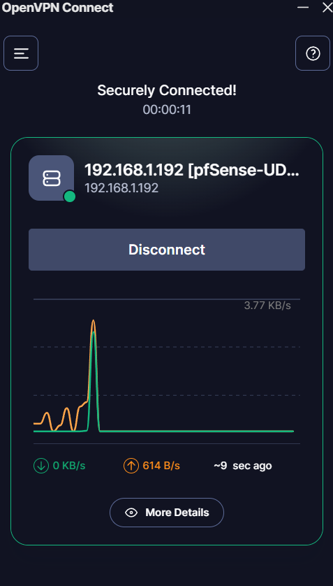
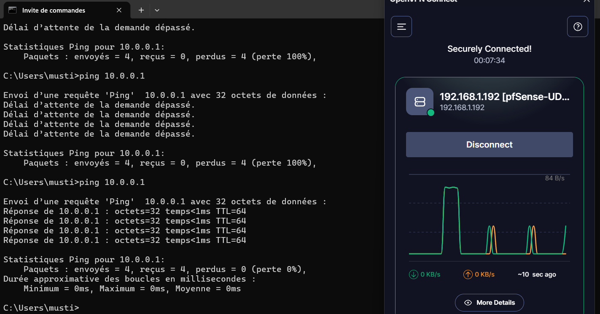

# 05 — OpenVPN

## Objectif

Configurer un accès VPN distant sécurisé au lab via pfSense et OpenVPN, permettant d'accéder à tous les réseaux internes depuis n'importe où.

## Résultat attendu

- Tunnel VPN opérationnel sur le port `1194/UDP`
- Accès à tous les réseaux internes depuis l'extérieur
- Authentification par certificat + mot de passe

---

## Procédure

### Installation du package

**System > Package Manager > Available Packages** → installer `openvpn-client-export`

### Création de l'autorité de certification

**System > Certificates > Authorities > Add**

| Paramètre | Valeur |
|-----------|--------|
| Descriptive name | `Lab-CA` |
| Method | `Create an internal Certificate Authority` |
| Key type | `RSA 2048` |
| Digest Algorithm | `sha256` |
| Lifetime | `3650 jours` |
| Common Name | `Lab-CA` |
| Country Code | `FR` |

### Création du certificat serveur

**System > Certificates > Certificates > Add**

| Paramètre | Valeur |
|-----------|--------|
| Descriptive name | `Lab-VPN-Server` |
| Certificate Authority | `Lab-CA` |
| Certificate Type | `Server Certificate` |
| Common Name | `Lab-VPN-Server` |

### Configuration du serveur OpenVPN

**VPN > OpenVPN > Servers > Add**

| Paramètre | Valeur |
|-----------|--------|
| Server mode | `Remote Access (SSL/TLS + User Auth)` |
| Protocol | `UDP on IPv4 only` |
| Interface | `WAN` |
| Port | `1194` |
| Description | `Lab-VPN` |
| Peer Certificate Authority | `Lab-CA` |
| Server Certificate | `Lab-VPN-Server` |
| IPv4 Tunnel Network | `10.99.0.0/24` |
| IPv4 Local network(s) | `10.0.0.0/8` |
| DNS Server | `8.8.8.8` |

### Création de l'utilisateur VPN

**System > User Manager > Add**

| Paramètre | Valeur |
|-----------|--------|
| Username | `vpn-user` |
| Certificate | `vpn-user` (signé par `Lab-CA`) |

### Règles firewall

**Firewall > Rules > WAN** — autoriser le port VPN :

| Champ | Valeur |
|-------|--------|
| Protocol | `UDP` |
| Destination | `WAN address` |
| Port | `1194` |
| Description | `OpenVPN entrant` |

**Firewall > Rules > OpenVPN** — autoriser le trafic VPN vers le lab :

| Champ | Valeur |
|-------|--------|
| Action | `Pass` |
| Source | `Any` |
| Destination | `Any` |
| Description | `VPN accès lab` |

### Export du profil client

**VPN > OpenVPN > Client Export** → télécharger **Most Clients** pour `vpn-user`

---

## Validation

Connexion VPN établie depuis le PC :

Ping vers pfSense LAN (`10.0.0.1`) depuis le PC via VPN :

---

⬅️ Étape précédente : [04 — Debian Admin](04-debian-admin.md)
