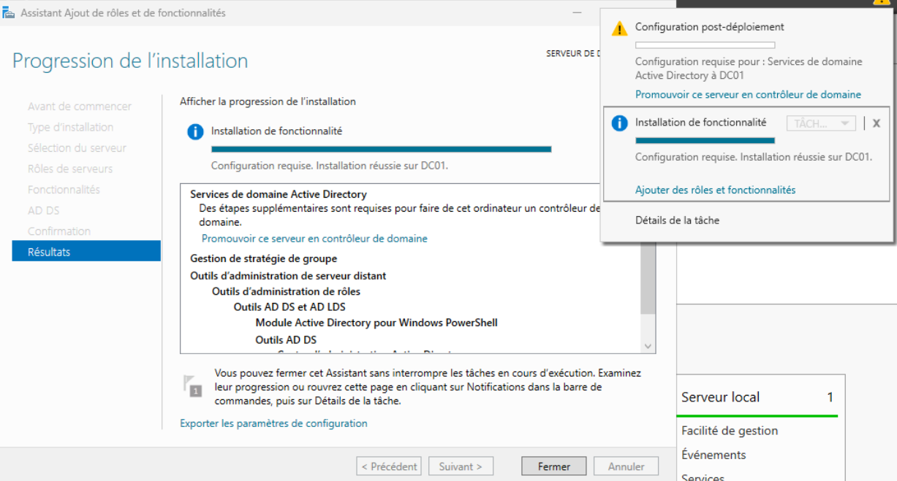
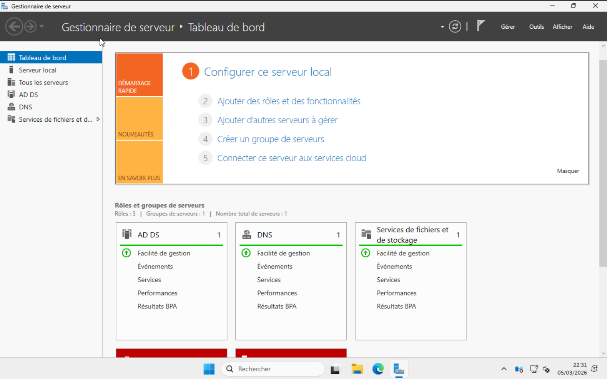
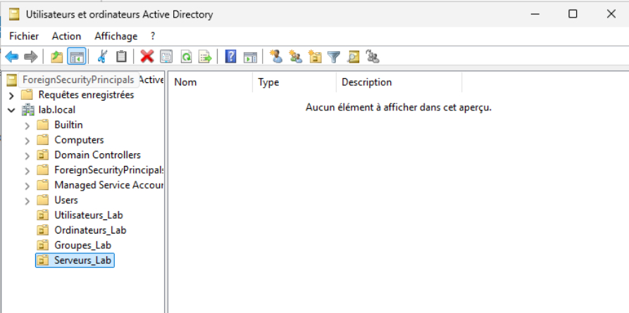
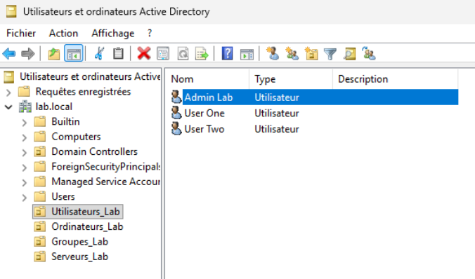
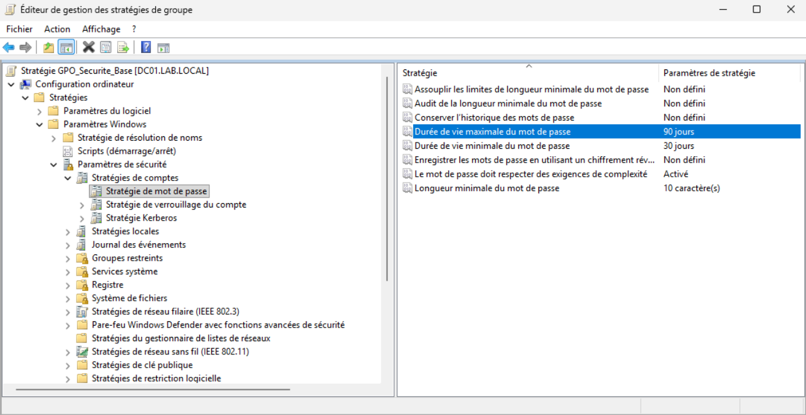
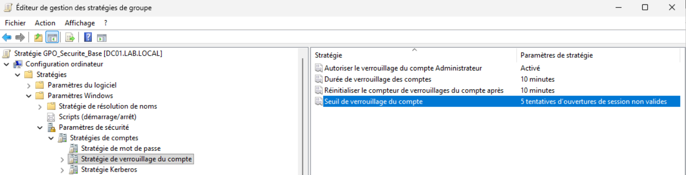
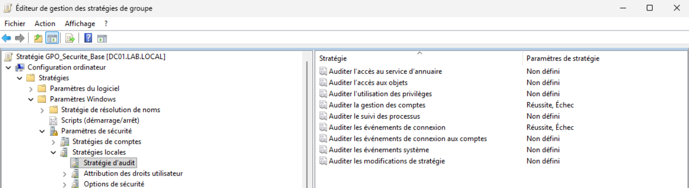
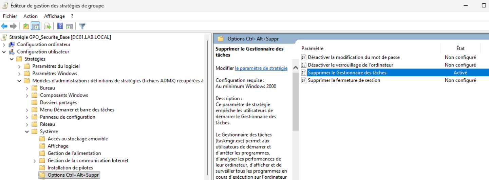
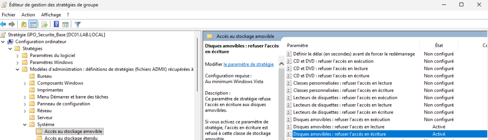

# 06 — Windows Server 2025 — Active Directory

## Objectif

Déployer un contrôleur de domaine Active Directory sur Windows Server 2025, créer la structure organisationnelle et appliquer des GPO de sécurité.

## Résultat attendu

- Domaine `lab.local` opérationnel
- OUs, groupes et utilisateurs créés
- GPO de sécurité appliquées

---

## Procédure

### Création de la VM

| Paramètre | Valeur |
|-----------|--------|
| VM ID | `102` |
| Nom | `WS2025-DC01` |
| OS | Windows Server 2025 Standard (expérience utilisateur) |
| Disque | `60 GB` |
| CPU | `4 cores` |
| RAM | `4096 MB` |
| Réseau | `vmbr1` — LAN |

### Configuration initiale

- Renommage du serveur en `DC01` via PowerShell :
```powershell
Rename-Computer -NewName "DC01" -Restart
```

- IP statique configurée via l'interface graphique :

| Paramètre | Valeur |
|-----------|--------|
| Adresse IP | `10.0.0.2` |
| Masque | `255.255.0.0` |
| Passerelle | `10.0.0.1` |
| DNS préféré | `10.0.0.2` |

---

### Installation du rôle AD DS

**Gestionnaire de serveur > Ajouter des rôles et fonctionnalités**

Rôle installé : **Services de domaine Active Directory**



---

### Promotion en contrôleur de domaine

**Gestionnaire de serveur > Promouvoir ce serveur en contrôleur de domaine**

| Paramètre | Valeur |
|-----------|--------|
| Type | `Nouvelle forêt` |
| Domaine racine | `lab.local` |
| Niveau fonctionnel | `Windows Server 2025` |
| Nom NetBIOS | `LAB` |
| DNS | `Activé` |
| Catalogue global | `Activé` |



---

### Structure Active Directory

**Outils > Utilisateurs et ordinateurs Active Directory**

#### Unités d'organisation (OU)

| OU | Description |
|----|-------------|
| `Utilisateurs_Lab` | Comptes utilisateurs du lab |
| `Ordinateurs_Lab` | Postes clients |
| `Groupes_Lab` | Groupes de sécurité |
| `Serveurs_Lab` | Serveurs membres |



#### Groupes

| Groupe | Type | Étendue |
|--------|------|---------|
| `GRP_Admin` | Sécurité | Global |
| `GRP_Users` | Sécurité | Global |
| `GRP_Serveurs` | Sécurité | Global |

#### Utilisateurs

| Login | Groupe |
|-------|--------|
| `admin.lab` | `GRP_Admin` |
| `user.one` | `GRP_Users` |
| `user.two` | `GRP_Users` |



---

### GPO — GPO_Securite_Base

**Outils > Gestion des stratégies de groupe > lab.local > Créer un objet GPO**

#### Stratégie de mot de passe

| Paramètre | Valeur |
|-----------|--------|
| Longueur minimale | `10 caractères` |
| Complexité | `Activé` |
| Durée de vie maximale | `90 jours` |



#### Verrouillage de compte

| Paramètre | Valeur |
|-----------|--------|
| Seuil de verrouillage | `5 tentatives` |
| Durée de verrouillage | `10 minutes` |
| Réinitialisation compteur | `10 minutes` |



#### Audit des connexions

| Paramètre | Valeur |
|-----------|--------|
| Événements de connexion | `Réussite, Échec` |
| Gestion des comptes | `Réussite, Échec` |



#### Désactivation du gestionnaire des tâches

**Configuration utilisateur > Modèles d'administration > Système > Options Ctrl+Alt+Suppr**

- Supprimer le Gestionnaire des tâches → `Activé`



#### Restriction USB

**Configuration ordinateur > Modèles d'administration > Système > Accès au stockage amovible**

- Disques amovibles : refuser l'accès en lecture → `Activé`
- Disques amovibles : refuser l'accès en écriture → `Activé`



---

## Validation

- ✅ Domaine `lab.local` opérationnel
- ✅ DC01 contrôleur de domaine principal
- ✅ DNS intégré à l'AD
- ✅ OUs, groupes et utilisateurs créés
- ✅ GPO_Securite_Base appliquée au domaine

---

⬅️ Étape précédente : [05 — OpenVPN](05-openvpn.md)
