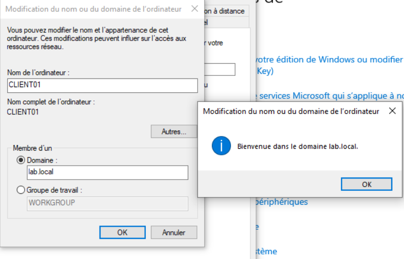
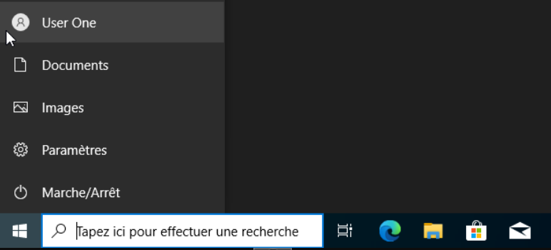
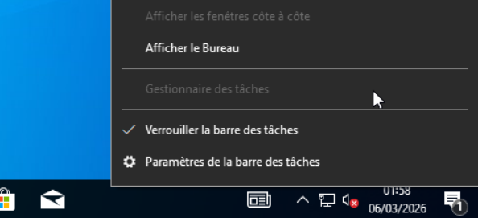

# 07 — Windows 10 Client — Jonction au domaine

## Objectif

Déployer un poste client Windows 10 Pro, le joindre au domaine `lab.local` et valider l'application des GPO.

## Résultat attendu

- CLIENT01 membre du domaine `lab.local`
- Connexion avec comptes du domaine fonctionnelle
- GPO appliquées et vérifiées

---

## Procédure

### Création de la VM

| Paramètre | Valeur |
|-----------|--------|
| VM ID | `103` |
| Nom | `WIN10-CLIENT01` |
| OS | Windows 10 Pro |
| Disque | `40 GB` |
| CPU | `2 cores` |
| RAM | `2048 MB` |
| Réseau | `vmbr1` — LAN |

### Configuration initiale

- Compte local temporaire : `LocalAdmin`
- IP statique configurée :

| Paramètre | Valeur |
|-----------|--------|
| Adresse IP | `10.0.0.50` |
| Masque | `255.255.0.0` |
| Passerelle | `10.0.0.1` |
| DNS préféré | `10.0.0.2` (DC01) |

---

### Jonction au domaine

**Clic droit Ce PC > Propriétés > Paramètres système avancés > Nom de l'ordinateur > Modifier**

| Paramètre | Valeur |
|-----------|--------|
| Nom de l'ordinateur | `CLIENT01` |
| Domaine | `lab.local` |
| Credentials | `Administrateur` / mot de passe DC |

---

## Validation

### Connexion avec compte du domaine

Connexion avec `LAB\user.one` après redémarrage.

### GPO — Gestionnaire des tâches bloqué

Le gestionnaire des tâches est grisé pour les utilisateurs du domaine — GPO `GPO_Securite_Base` bien appliquée.

---

## Validation

- ✅ CLIENT01 joint au domaine `lab.local`
- ✅ Connexion avec compte domaine `user.one` fonctionnelle
- ✅ GPO appliquée — gestionnaire des tâches bloqué

---

⬅️ Étape précédente : [06 — Windows Server AD](06-windows-server-ad.md)
