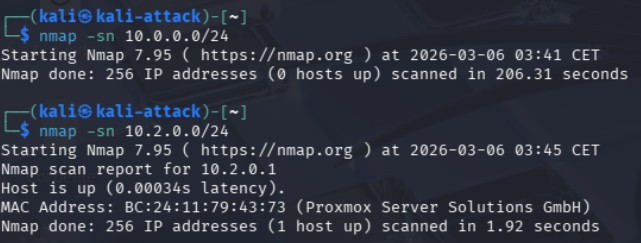
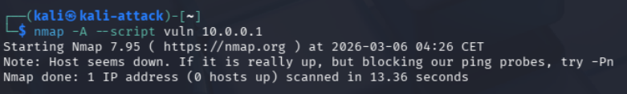

# 08 — Kali Linux — VM d'attaque

## Objectif

Déployer une VM Kali Linux sur le réseau ATTACK pour simuler des attaques et valider la segmentation réseau et la détection d'intrusion.

## Résultat attendu

- Kali opérationnel sur le réseau ATTACK (`vmbr3`)
- Accès internet via pfSense
- Scan réseau fonctionnel
- Trafic vers LAN bloqué par pfSense

---

## Procédure

### Création de la VM

| Paramètre | Valeur |
|-----------|--------|
| VM ID | `104` |
| Nom | `Kali-Attack` |
| OS | Kali Linux (latest) |
| Disque | `40 GB` |
| CPU | `2 cores` |
| RAM | `4096 MB` |
| Réseau | `vmbr3` — ATTACK |

### Installation

- Environnement de bureau : **Xfce**
- Outils : **top10 + outils par défaut**
- Hostname : `kali-attack`
- Domain : `lab.local`

### Configuration réseau

IP attribuée automatiquement par pfSense via DHCP :

```
eth0: 10.2.7.12/16
Gateway: 10.2.0.1
```


---

## Tests de segmentation réseau

### Scan du réseau ATTACK

```bash
nmap -sn 10.2.0.0/24
```

Résultat : seul pfSense (`10.2.0.1`) est visible depuis ATTACK.



### Scan du réseau LAN (bloqué)

```bash
nmap -sn 10.0.0.0/24
```

Résultat : **0 hosts up** — pfSense bloque le trafic ATTACK → LAN comme configuré dans les règles firewall.

### Scan agressif vers pfSense

```bash
nmap -A -sV 10.2.0.1
```

Résultat : détecté par Suricata (voir doc 09).

### Tentative de scan vers LAN via scripts vulnérabilités

```bash
nmap -A --script vuln 10.0.0.1
```

Résultat : **Host seems down** — pfSense bloque en amont, Suricata ne voit rien.



---

## Validation

- ✅ Kali opérationnel sur réseau ATTACK
- ✅ IP DHCP attribuée par pfSense
- ✅ ATTACK → LAN : bloqué par firewall
- ✅ ATTACK → pfSense : visible (gateway uniquement)
- ✅ Scans détectés par Suricata sur l'interface ATTACK

---

⬅️ Étape précédente : [07 — Windows 10 Client](07-win10-client.md)
➡️ Étape suivante : [09 — Suricata IDS/IPS](09-suricata.md)
