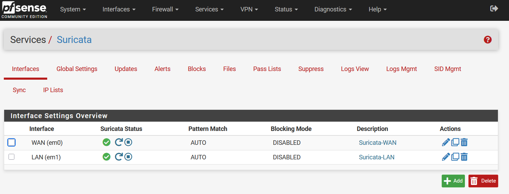
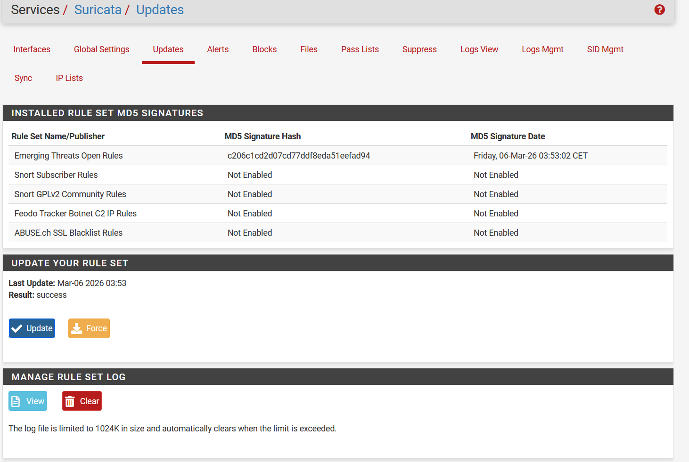
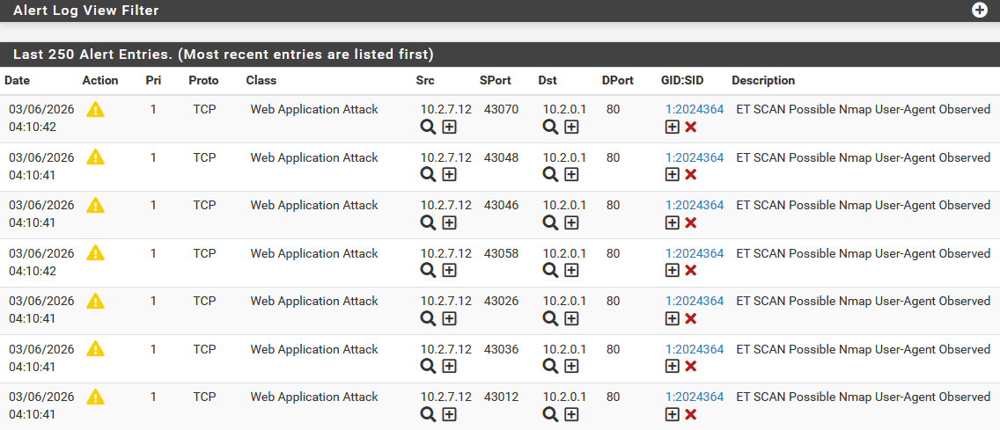

# 09 — Suricata IDS/IPS

## Objectif

Déployer Suricata sur pfSense pour détecter les intrusions et attaques réseau en temps réel, et valider la détection avec Kali Linux.

## Résultat attendu

- Suricata actif sur WAN, LAN et ATTACK
- Règles Emerging Threats chargées
- Alertes générées lors des scans Kali

---

## Procédure

### Installation

**System > Package Manager > Available Packages** → installer `suricata`

### Configuration des interfaces

**Services > Suricata > Interfaces > Add**

| Interface | Description | Statut |
|-----------|-------------|--------|
| WAN (em0) | `Suricata-WAN` | ✅ Actif |
| LAN (em1) | `Suricata-LAN` | ✅ Actif |
| ATTACK (em3) | `Suricata-ATTACK` | ✅ Actif |



### Téléchargement des règles

**Services > Suricata > Global Settings**

- ETOpen Emerging Threats rules : ✅ activé
- Update Interval : `12 hours`

**Services > Suricata > Updates > Update Rules**



### Catégories de règles activées

Sur chaque interface (WAN + LAN + ATTACK) :

| Règle | Description |
|-------|-------------|
| `emerging-scan.rules` | Détection des scans réseau |
| `emerging-exploit.rules` | Tentatives d'exploitation |
| `emerging-icmp.rules` | Anomalies ICMP |
| `emerging-malware.rules` | Trafic malware |
| `emerging-netbios.rules` | Attaques NetBIOS |
| `emerging-dos.rules` | Déni de service |
| `emerging-shellcode.rules` | Shellcode dans le trafic |

---

## Validation — Détection du scan Kali

### Test : scan Nmap agressif depuis Kali

```bash
nmap -A -sV 10.2.0.1
```

Résultat dans **Services > Suricata > Alerts** :

Suricata détecte `10.2.7.12` (Kali) → `10.2.0.1` (pfSense) avec l'alerte :
`ET SCAN Possible Nmap User-Agent Observed`



### Test : scan vers LAN (bloqué par firewall)

```bash
nmap -A --script vuln 10.0.0.1
```

Résultat : **aucune alerte Suricata** — pfSense bloque le trafic ATTACK → LAN avant qu'il atteigne Suricata. Le firewall agit en amont de l'IDS.

---

## Synthèse des résultats

| Scénario | Firewall | Suricata | Résultat |
|----------|----------|----------|----------|
| Kali → pfSense (10.2.0.1) | Autorisé | ✅ Alerte | Détecté |
| Kali → LAN (10.0.0.0/16) | ❌ Bloqué | Pas d'alerte | Bloqué avant IDS |
| Kali → internet | Autorisé | Surveillance | Normal |

> La segmentation réseau et l'IDS fonctionnent en complémentarité : pfSense bloque les flux interdits, Suricata analyse les flux autorisés.

---

## Validation

- ✅ Suricata actif sur 3 interfaces
- ✅ Règles ET chargées et à jour
- ✅ Scan Nmap détecté en temps réel
- ✅ Comportement conforme à la politique de sécurité

---

⬅️ Étape précédente : [08 — Kali Linux](08-kali-linux.md)
