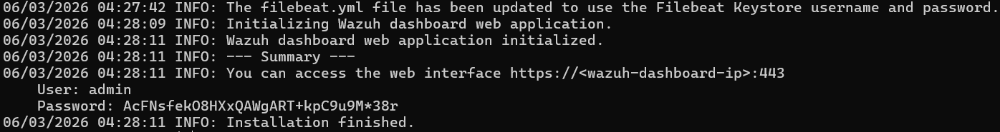
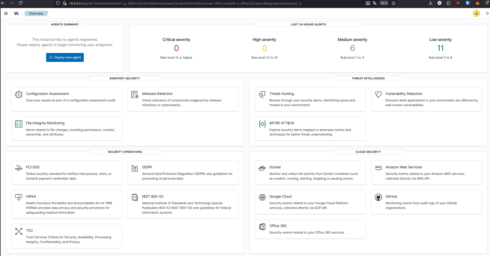
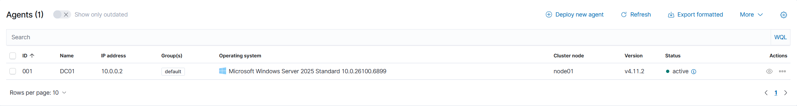
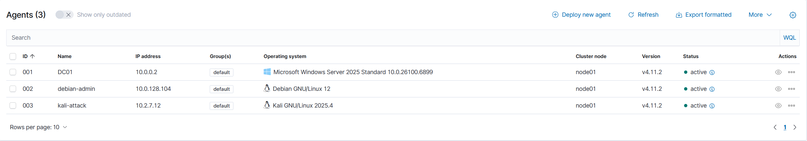
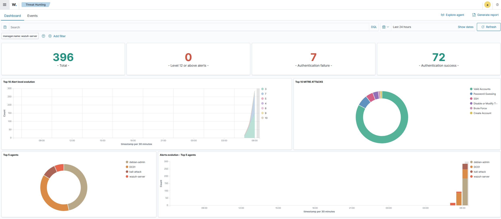
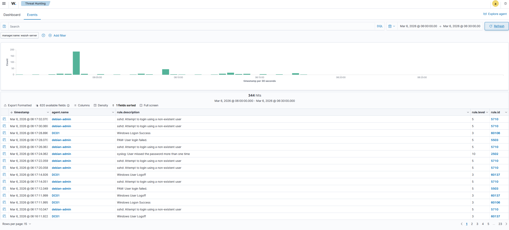

# 10 — Wazuh — SIEM & XDR

## Objectif

Déployer Wazuh comme solution SIEM centrale du lab pour collecter, corréler et analyser les événements de sécurité de toutes les VMs en temps réel.

## Résultat attendu

- Wazuh Server opérationnel sur le réseau MGMT (`vmbr4`)
- Agents déployés sur DC01, debian-admin et kali-attack
- Détection d'événements de sécurité en temps réel
- Dashboard Threat Hunting fonctionnel

---

## Procédure

### Création de la VM

| Paramètre | Valeur |
|-----------|--------|
| VM ID | `105` |
| Nom | `Wazuh-Server` |
| OS | Ubuntu Server 24.04 |
| Disque | `50 GB` |
| CPU | `4 cores` |
| RAM | `8192 MB` |
| Réseau | `vmbr4` — MGMT |

### Configuration réseau

IP statique configurée pendant l'installation :

```
ens18: 10.3.0.2/16
Gateway: 10.3.0.1
DNS: 10.0.0.2 (DC01)
```

### Installation

Script d'installation automatique Wazuh (manager + indexer + dashboard) :

```bash
curl -sO https://packages.wazuh.com/4.11/wazuh-install.sh && sudo bash wazuh-install.sh -a
```



### Accès au dashboard

```
https://10.3.0.2
```

Identifiants générés automatiquement à la fin de l'installation.



---

## Déploiement des agents

Les agents sont déployés depuis **Wazuh > Deploy new agent** — la commande est générée automatiquement avec l'adresse du serveur et le nom de l'agent.

### DC01 (Windows Server 2025)

Commande exécutée en PowerShell administrateur :

```powershell
Invoke-WebRequest -Uri https://packages.wazuh.com/4.x/windows/wazuh-agent-4.11.2-1.msi `
  -OutFile $env:tmp\wazuh-agent; msiexec.exe /i $env:tmp\wazuh-agent /q `
  WAZUH_MANAGER='10.3.0.2' WAZUH_AGENT_NAME='DC01'

NET START WazuhSvc
```



### debian-admin (Debian 12)

```bash
WAZUH_MANAGER='10.3.0.2' WAZUH_AGENT_NAME='debian-admin' dpkg -i ./wazuh-agent_4.11.2-1_amd64.deb
systemctl daemon-reload
systemctl enable wazuh-agent
systemctl start wazuh-agent
```

### kali-attack (Kali Linux)

Même procédure que debian-admin. SSH installé au préalable :

```bash
sudo apt install openssh-server -y
```



---

## Validation — Détection d'événements

### Test : brute-force SSH sur debian-admin

Tentatives de connexion SSH avec un utilisateur inexistant depuis localhost :

```bash
ssh fakeuser@localhost
```

Wazuh détecte et corrèle immédiatement les événements depuis les deux agents :

| Agent | Événement détecté |
|-------|-------------------|
| debian-admin | `sshd: Attempt to login using a non-existent user` |
| debian-admin | `PAM: User login failed` |
| debian-admin | `syslog: User missed the password more than one time` |
| DC01 | `Windows Logon Success / Logoff` |





### Note sur la segmentation réseau

Le brute-force Hydra lancé depuis Kali (`10.2.7.12`) vers la Debian (`10.0.128.104`) n'a produit aucune alerte — pfSense bloque le trafic ATTACK → LAN en amont. Les deux couches de sécurité (firewall + SIEM) fonctionnent en complémentarité.

---

## Validation

- ✅ Wazuh Server installé sur le réseau MGMT
- ✅ Dashboard accessible via HTTPS
- ✅ 3 agents actifs (DC01, debian-admin, kali-attack)
- ✅ Événements SSH détectés en temps réel
- ✅ Corrélation multi-agents fonctionnelle
- ✅ MITRE ATT&CK mapping opérationnel

---

⬅️ Étape précédente : [09 — Suricata IDS/IPS](09-suricata.md)
➡️ Étape suivante : [11 — Fail2ban](11-fail2ban.md)
