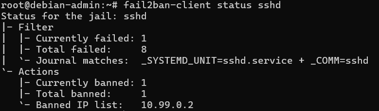

# 11 — Fail2ban — Hardening SSH

## Objectif

Déployer Fail2ban sur la VM debian-admin pour bloquer automatiquement les adresses IP effectuant des tentatives de connexion SSH répétées.

## Résultat attendu

- Fail2ban actif sur debian-admin
- Blocage automatique après 5 tentatives SSH échouées
- Durée de ban : 1 heure
- Validation par test réel depuis le PC via VPN

---

## Procédure

### Installation

```bash
apt install fail2ban -y
```

### Configuration

Création du fichier de config local à partir du template :

```bash
cp /etc/fail2ban/jail.conf /etc/fail2ban/jail.local
```

Configuration de la jail SSH dans `/etc/fail2ban/jail.local` :

```ini
[sshd]
enabled  = true
maxretry = 5
findtime = 10m
bantime  = 1h
port     = ssh
logpath  = %(sshd_log)s
backend  = systemd
```

> Le backend `systemd` est nécessaire sur Debian 12 — les logs SSH passent par journald, pas par `/var/log/auth.log`.

### Démarrage

```bash
systemctl restart fail2ban
systemctl enable fail2ban
```

---

## Validation

### Test de bannissement

6 tentatives SSH avec un utilisateur inexistant depuis le PC (VPN connecté, IP `10.99.0.2`) :

```bash
ssh fakeuser@10.0.128.104
```

Résultat après 5 échecs :

```bash
fail2ban-client status sshd
```



Fail2ban a détecté 8 tentatives échouées et banni automatiquement `10.99.0.2`.

### Débannissement

```bash
fail2ban-client unban 10.99.0.2
```

---

## Validation

- ✅ Fail2ban installé et actif sur debian-admin
- ✅ Backend systemd configuré (Debian 12)
- ✅ Ban automatique après 5 tentatives échouées
- ✅ IP VPN bannie et débannie avec succès

---

⬅️ Étape précédente : [10 — Wazuh SIEM](10-wazuh.md)
➡️ Étape suivante : [12 — GLPI](12-glpi.md)
