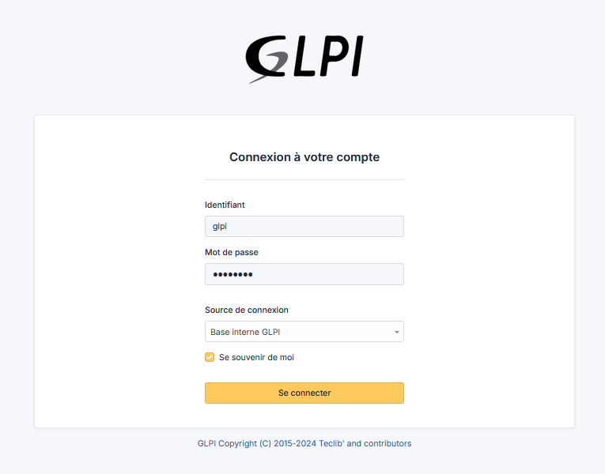
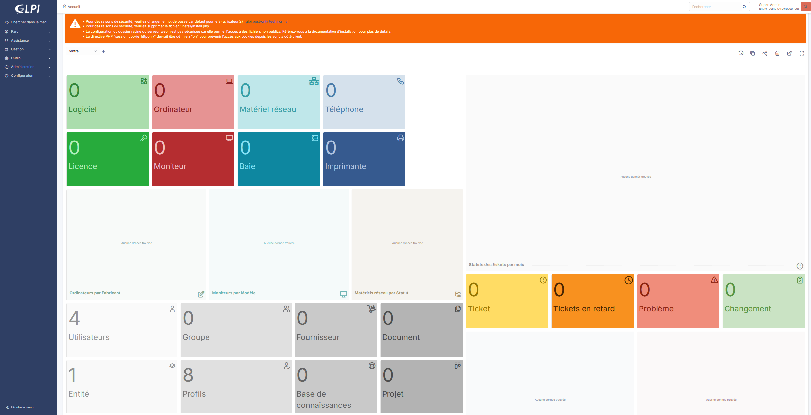
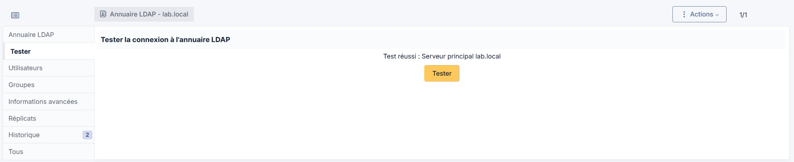
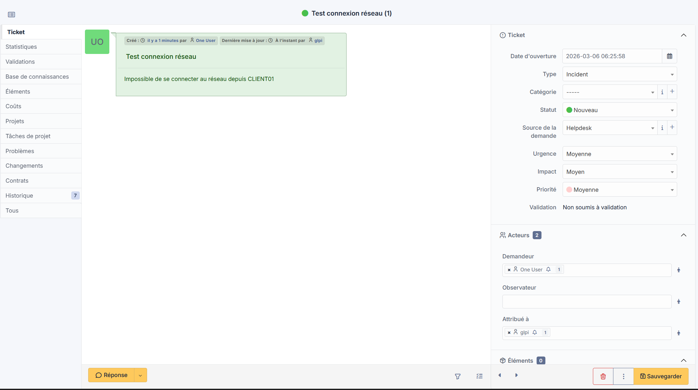

# 12 — GLPI — Ticketing & Inventaire

## Objectif

Déployer GLPI sur la VM debian-admin pour gérer les tickets d'incidents et l'inventaire du parc, intégré à l'Active Directory via LDAP.

## Résultat attendu

- GLPI accessible via navigateur depuis le LAN
- Authentification LDAP connectée à lab.local
- Utilisateurs AD importés
- Ticket de test créé avec succès

---

## Procédure

### Prérequis — Stack LAMP

```bash
apt install -y apache2 php php-mysql php-curl php-gd php-intl php-ldap \
  php-xml php-zip php-bz2 php-mbstring mariadb-server
```

### Base de données MariaDB

```sql
CREATE DATABASE glpi CHARACTER SET utf8mb4 COLLATE utf8mb4_unicode_ci;
CREATE USER 'glpi'@'localhost' IDENTIFIED BY 'Glpi2025';
GRANT ALL PRIVILEGES ON glpi.* TO 'glpi'@'localhost';
FLUSH PRIVILEGES;
```

### Installation GLPI

```bash
cd /tmp
wget https://github.com/glpi-project/glpi/releases/download/10.0.17/glpi-10.0.17.tgz
tar -xzf glpi-10.0.17.tgz -C /var/www/html/
chown -R www-data:www-data /var/www/html/glpi
chmod -R 755 /var/www/html/glpi
```

### Configuration Apache

`/etc/apache2/sites-available/glpi.conf` :

```apache
<VirtualHost *:80>
    ServerName glpi.lab.local
    DocumentRoot /var/www/html/glpi

    <Directory /var/www/html/glpi>
        AllowOverride All
        Require all granted
    </Directory>
</VirtualHost>
```

```bash
a2ensite glpi.conf
a2enmod rewrite
a2dissite 000-default.conf
systemctl restart apache2
```

### Setup via navigateur

Accès : `http://10.0.128.104`

- Sélection de la base de données : `glpi` / `Glpi2025`
- Installation complète via l'assistant web





---

## Intégration Active Directory (LDAP)

**Configuration > Authentification > Annuaires LDAP > Ajouter**

| Paramètre | Valeur |
|-----------|--------|
| Nom | `lab.local` |
| Serveur | `10.0.0.2` |
| Port | `389` |
| BaseDN | `DC=lab,DC=local` |
| DN du compte | `CN=Administrateur,CN=Users,DC=lab,DC=local` |
| Champ identifiant | `sAMAccountName` |
| Filtre de connexion | `(&(objectClass=user)(!(userAccountControl:1.2.840.113556.1.4.803:=2)))` |

> Note : Windows Server 2025 exige par défaut la signature LDAP. La désactivation de la GPO **"Contrôleur de domaine : application des conditions requises pour la signature de serveur LDAP"** est nécessaire pour autoriser les connexions non chiffrées.



### Import des utilisateurs AD

**Administration > Utilisateurs > Liaison annuaire LDAP > Importation de nouveaux utilisateurs**

Utilisateurs importés depuis `OU=Utilisateurs_Lab,DC=lab,DC=local` :

| Login | Nom | Groupe AD |
|-------|-----|-----------|
| `alab` | Admin Lab | GRP_Admin |
| `uone` | User One | GRP_Users |
| `utwo` | User Two | GRP_Users |


---

## Validation — Création d'un ticket

Ticket de test créé depuis **Assistance > Tickets > Ajouter** :

- **Titre** : `Test connexion réseau`
- **Description** : `Impossible de se connecter au réseau depuis CLIENT01`
- **Demandeur** : `uone`
- **Type** : Incident
- **Priorité** : Moyenne



---

## Validation

- ✅ GLPI 10.0.17 installé sur debian-admin
- ✅ Accessible via `http://10.0.128.104`
- ✅ Connexion LDAP à lab.local fonctionnelle
- ✅ Utilisateurs AD importés (alab, uone, utwo)
- ✅ Ticket d'incident créé avec succès

---

⬅️ Étape précédente : [11 — Fail2ban](11-fail2ban.md)
➡️ Étape suivante : [13 — Zabbix](13-zabbix.md)
